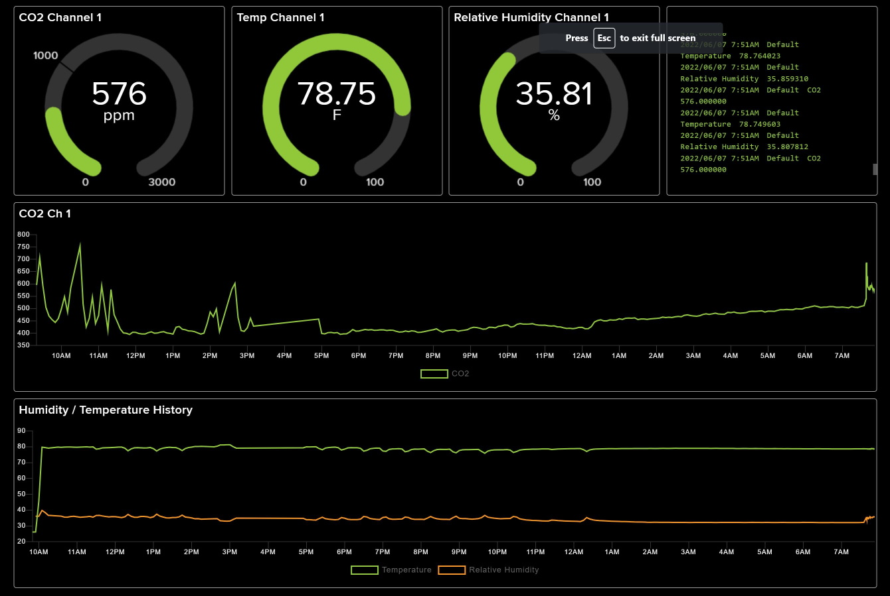

# SC22 demo

## Introduction

This demo application reads out the Sensirion SCD40 and SHT40 sensors, optionally displays the values on the local device' display, and optionally uploads the data to [Adafruit IO](https://io.adafruit.com).

## Prerequisites

### Base setup
- Adafruit ESP32-S2 TFT and Adafruit ESP32-S2 QT Py boards
- SCD40 breakout board
- SHT40 breakout board

### Arduino IDE libraries

Install the following libraries and all its dependencies in Arduino IDE:

#### Required
- Adafruit NeoPixel
- Sensirion I2C SCD4x
- arduino-sht

#### Optional
- Network upload (Adafruit IO): Adafruit IO Arduino
- TFT: Adafruit ST7735 and ST7789 Library

### For cloud upload 
- Adafruit IO account
- Arduino with Wifi functionality
- Arduino needs to be compatible with Adafruit IO Wifi setup code

### For local display
- Adafruit_ST7789 compatible display


## Local Preparation
- Check out this repository
- Open `sc22.ino`
- Adapt `config.h` to your network settings, Adafruit IO user name/key
- Compile and run

## Prepare Adafruit IO

### Setup Feeds
Visit [Adafruit IO](https://io.adafruit.com) and log in to your account. Then, select "Feeds" > "View all" from the navigation, which will give you a list of existing feeds. On that webpage, create three feeds as such:

|Feed name|Feed key|
|----------|-------|
|CO2|sc22-co2-1|
|Relative Humidity|sc22-rh-1|
|Temperature|sc22-t-1|

While the feed name doesn't need to be exactly as shown, please note that if you change the feed key, you will need to update the code (see below, "Demo Configuration")

### Setup dashboard
Visit [Adafruit IO](https://io.adafruit.com) and log in to your account. Then, select "Dashboards" > "View all" from the navigation, which will give you a list of existing dashboards. On that webpage, create a new dashboard for this demo (name of the dashboard does not matter, so choose something that makes sense to you).

You can setup your dashboard in any way you like. We would recommend the following as a starting point:
- Add three "gauge" blocks; connect them to the three feeds created in the section above
- Create two "line chart" blocks; connect the first to CO2, and the second to RH and T
- Recommended: for the initial setup, it is recommended to add a "stream" type block too, which will help you see incoming events

If you followed the instructions above, your dashboard should looks similar to this:



## Demo Configuration

`sc22.ino` has a number of configuration options at the beginning of the file:

```c++
#define USE_NETWORK 1             // enable network upload
#define USE_F       1             // output temperature in Fahrenheit (alternative: Celcius)

#define CO2_THRESHOLD_RED    1200 // CO2 threshold for "orange" warning
#define CO2_THRESHOLD_ORANGE 1000 // CO2 threshold for "red" alarm

#define IO_UPLOAD_INTERVAL_S 10   // interval for cloud upload in seconds
#define IO_CO2_CHANNEL "sc22_co2_1" // Channel name for CO2
#define IO_RH_CHANNEL   "sc22_rh_1" // Channel name for relative humidity
#define IO_T_CHANNEL     "sc22_t_1" // Channel name for temperature

// display configuration
#define USE_DISPLAY 1             // enable display on ESP32-S2 TFT

#define FONT_SIZE     3
#define TITLE_OFFSET 10
#define LINE_OFFSET  30
```

### USE_NETWORK
This switch turns the network upload on (1) and off (0)

### USE_F
Choose whether temperatures should be displayed and uploaded in Fahrenheit (1) or Celcius (0)

### CO2_THRESHOLD_RED, CO2_THRESHOLD_ORANGE
CO2 thresholds in PPM (Parts Per Million) for local display; this will be used to change the color of the displayed value from green to orange to red and back

### IO_UPLOAD_INTERVAL_S
This defines the time between uploads to Adafruit IO, in seconds. Note that IO limits the upload rates, so choosing a low value here might mean that you're hitting those limits.

The CO2 sensor itself is only updated every 5 seconds, while the Humidity/Temperature sensor is updated every second.

### IO_CO2_CHANNEL, IO_RH_CHANNEL, IO_T_CHANNEL
These are the feed keys we configured in Adafruit IO. If you used the name in the table above, no changes should be necessary here

### USE_DISPLAY
Choose whether you want to use the display (1) or not (0)

### FONT_SIZE, TITLE_OFFSET, LINE_OFFSET
These settings are used to influence the display layout.


## Troubleshooting

This demo logs a fair amount of information to the serial console; use this as a starting point for debugging

### Led codes
1. LED white: during initialization / sensor probing
2. LED blue: Adafruit IO init
3. LED green: initialization done
4. LED blinking red: panic; reset boarda
5. LED static red: IO connection lost
